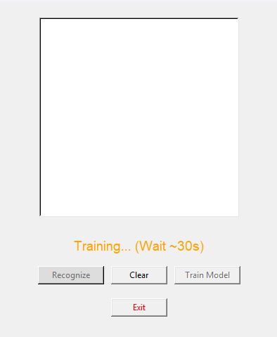
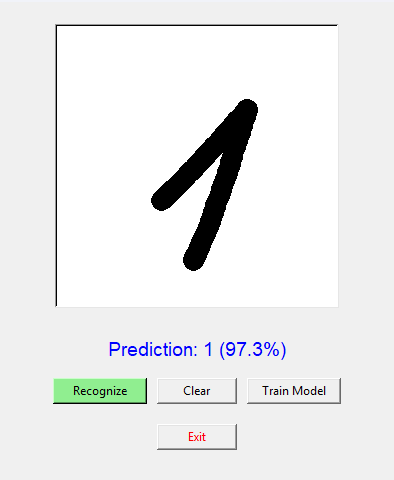

<div align="center">

# 🧠 Handwritten Digit Recognizer
### An intelligent, real-time digit recognition app powered by PyTorch


<br>

**[ Report Bug ](https://github.com/v0id-core/digit-recognizer/issues) • [ Request Feature ](https://github.com/v0id-core/digit-recognizer/issues)**

</div>

---

## 💡 About The Project

This is not just another MNIST classifier. Most tutorials teach you to train a model, but they fail when you try to use it in real life because users don't draw perfectly centered digits.

**This project solves that problem.**

I built a custom desktop application with a **Smart Preprocessing Engine**. It behaves like a human eye: looking at the drawing, cropping the useless whitespace, and centering the digit-just like the data the AI was trained on.

## ✨ Key Features
*   **🧠 Custom CNN Architecture**: A lightweight but powerful Convolutional Neural Network.
*   **🎯 Smart Centering Algorithm**: Draw in the corner, draw small, draw big—it doesn't matter. The algorithm fixes your input automatically.
*   **🖥️ Native GUI**: No browser needed. Fast, responsive `tkinter` interface.
*   **⚙️ On-Device Training**: Train the neural network locally on your CPU/GPU with one click.
*   **🐧 Cross-Platform**: Runs smoothly on Windows, macOS, and Linux.


## 🖼️Screenshots



## 🛠 Installation

### Prerequisites
You need **Python 3.10+** installed.

### 1. Clone the repository
```bash
git clone https://github.com/v0id-core/digit-recognizer.git
cd digit-recognizer
```

### 2. Set up a Virtual Environment (Recommended)
Windows:
```bash
python -m venv venv
venv\Scripts\activate
```

macOS / Linux:
```bash
python3 -m venv venv
source venv/bin/activate

```
### 3. Install Dependencies
```bash
pip install -r requirements.txt
```

### 4. Run the desktop application
```bash
python desktop_app.py
```

## 🚀 Usage
- Train the model: If you launch the app for the first time, click "Train Model" in the app interface. The app will download the MNIST dataset and train the neural network (~1-2 minutes).
- Draw: Use your mouse to draw a digit (0-9) on the canvas.
- Recognize: Click "Recognize" to see the prediction and confidence score.

## 🤖 Tech Stack
- Core: Python 3.10+
- ML Framework: PyTorch, Torchvision
- GUI: Tkinter
- Image Processing: PIL (Pillow), NumPy

## ⚙️ Troubleshooting
- App doesn't start? Ensure that you have Python 3.10+ and all dependencies installed correctly. Check version: python --version.
- Training fails? Check your internet connection. The MNIST dataset requires downloading when you press "Train Model".

## 📝 License
- This project is licensed under the MIT License. You can freely use, modify, and distribute the code.

## 👨‍💻 Author
- v0id-core
- GitHub: https://github.com/v0id-core
